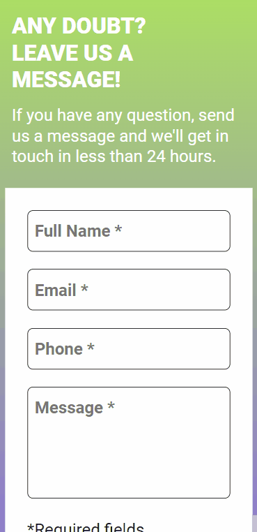

# Validation Form
This is a form validation made using JavaScript instead of HTML attributes. This application basically add a green border when the info is validated, or red when don't. If the user tries to submit the form with empty fields, or invalid info the action will be prevented.

## Desktop Overview 🖳

## Mobile Overview 📱

## Link 🔗
- [Form Validation]()

## Languages used 👨‍💻
- HTML
- CSS
- JavaScript

## What I learned 📖
- I needed to validate the e-mail field with the format of an actual e-mail address, so I learned what is RegEx and how to test it, then I could implement the validation.
- In order to avoid submitting the form when there's empty fields, or invalid info, I learned how to prevent default of submit button. 